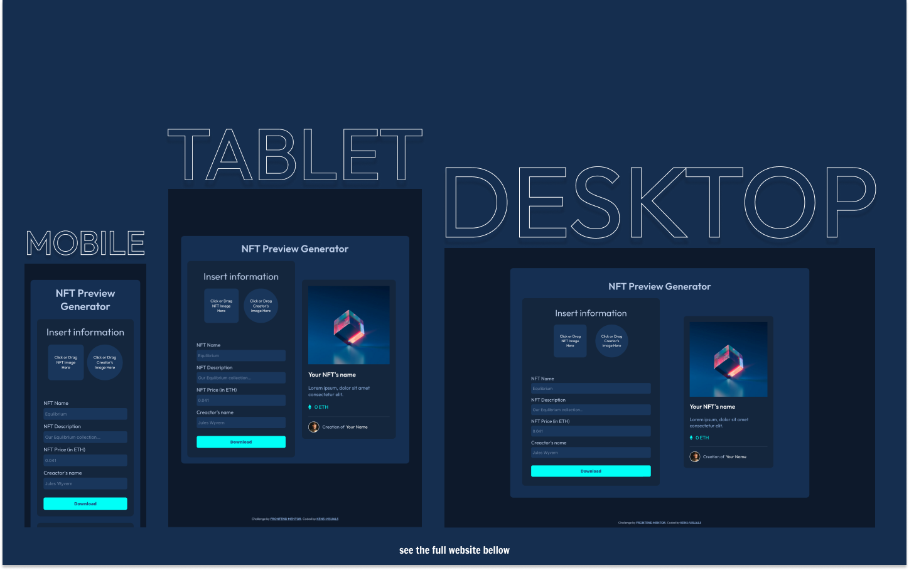

# Frontend Mentor - NFT Preview Card Generator Solution

This is a solution to the [NFT Preview Card Generator Challenge on Frontend Mentor](https://www.frontendmentor.io/challenges/nft-preview-card-component-SbdUL_w0U).

## Table of contents

- [Overview](#overview)
  - [The challenge](#the-challenge)
  - [Screenshot](#screenshot)
  - [Links](#links)
- [My process](#my-process)
  - [Built with](#built-with)
  - [What I learned](#what-i-learned)
  - [Continued development](#continued-development)
  - [Useful resources](#useful-resources)
- [Author's Links](#authors-links)

## Overview

### The challenge

Users should be able to:

- View the optimal layout depending on their device's screen size
- See hover states for interactive elements
- Upload images for NFT preview and user
- Insert information for NFT's name, description, price and user's name
- Be able to download the generated NFT preview card as PNG

### Screenshot

### Links

- Live Site URL: [https://kens-visuals.github.io/nft-preview-generator/](https://kens-visuals.github.io/nft-preview-generator/)
- Solution URL: [https://www.frontendmentor.io/solutions/nft-preview-card-generator-built-with-react-and-styledcomponents-iLzEaKy_X](https://www.frontendmentor.io/solutions/nft-preview-card-generator-built-with-react-and-styledcomponents-iLzEaKy_X)

## My process

### Built with

- React
- Styled Components
- Semantic HTML5 markup
- CSS Flexbox
- CSS Grid
- Mobile-first workflow

### What I learned

Right after seeing this project, I knew what I wanted to do with it and what I wanted to add to make it more functional. Although it took me a bit longer than I anticipated, I got the result I desired. I'm not much of a designer, but I tried to make the input panel as close to the original design as possible. The most challenging part of this project was creating a canvas from the generated card and making it downloadable. And thanks to a couple of packages, I managed to accomplish, which seems to be the main goal of the project.

### Useful resources

- [html2canvas](https://html2canvas.hertzen.com/) - This is the package that helped me to generate a canvas from the card.
- [FileSaver.js](https://github.com/eligrey/FileSaver.js/) - And with this simple package I was able to add the functionality for the download button.

## Author's Links

- Medium - [@kens_visuals](https://medium.com/@kens_visuals)
- CodePen - [@kens-visuals](https://codepen.io/kens-visuals)
- Codewars - [@kens_visuals](https://www.codewars.com/users/kens_visuals)
- Frontend Mentor - [@kens-visuals](https://www.frontendmentor.io/profile/kens-visuals)
